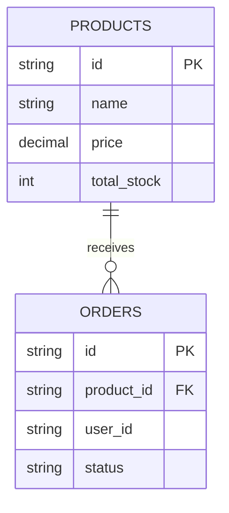

# Entity Relationship Diagram (Starter)

Lengkapi diagram relasi entitas berikut menggunakan notasi Mermaid.

```mermaid
erDiagram
    PRODUCTS ||--o{ ORDERS : receives
    PRODUCTS {
        string id PK
        string name
        decimal price
        int total_stock
    }
    ORDERS {
        string id PK
        string product_id FK
        string user_id
        string status
    }
```
